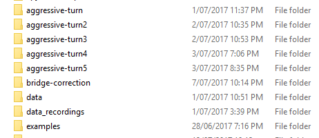
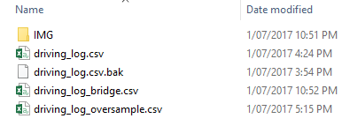
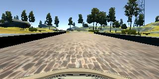
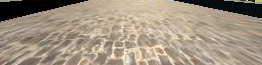

# Behavioral Cloning

## Writeup Template

### You can use this file as a template for your writeup if you want to submit it as a markdown file, but feel free to use some other method and submit a pdf if you prefer.

---

**Behavioral Cloning Project**

The goals / steps of this project are the following:

* Use the simulator to collect data of good driving behavior
* Build, a convolution neural network in Keras that predicts steering angles from images
* Train and validate the model with a training and validation set
* Test that the model successfully drives around track one without leaving the road
* Summarize the results with a written report


## Rubric Points

### Here I will consider the [rubric points](https://review.udacity.com/#!/rubrics/432/view) individually and describe how I addressed each point in my implementation.  

---

### Files Submitted & Code Quality

#### 1. Submission includes all required files and can be used to run the simulator in autonomous mode

My project includes the following files:  

**models**

* `model.py` containing the script to create and train the model
* `model_track2.py` containing the script to create and train the model (using personal GPU on Keras 2+)
* `model_track2_generator.py` containing the script to create and train the model with a generator - this worked but didn't seem to contribute much with more training data (using personal GPU on Keras 2+)

**drive.py**

* `drive.py` for driving the car in autonomous mode - a few adjustments such as set speed was made

**CNN model files** 

* `model.h5` containing a trained convolution neural network 
* `model_20170712.h5` contains the best network for track 2 (seems to work mostly okay for track 1 as well)

**video files**

* `video.mp4` example created using environment setup for nanodegree
* `video_20170707_new.mp4` example created using Keras 2.X with GPU
* `video_test1.mp4` example for track 1 and track 2

**write up**

* writeup_report.md 

#### 2. Submission includes functional code

Using the Udacity provided simulator and my drive.py file, the car can be driven autonomously around the track by executing 

```sh
python drive.py model.h5
```

#### 3. Submission code is usable and readable

The model.py file contains the code for training and saving the convolution neural network. The file shows the pipeline I used for training and validating the model, and it contains comments to explain how the code works.

### Model Architecture and Training Strategy

#### 1. An appropriate model architecture has been employed

The model chosen was simply the design selected in the Udacity videos (nVidia CNN). I made no adjustments as it was sufficient to pass track 1.

#### 2. Attempts to reduce overfitting in the model

Overfitting was an iterative process. I played around with drop-out layers and purposely fine-tuning the input data to ensure that it contained "good" driving practises. 

In the end I found that fine-tuning the input data was the optimal way to speedily improve the performance of the car on the track.

The model was validated using random 20% holdout dataset to prevent overfitting. 

#### 3. Model parameter tuning

The model used an adam optimizer, as per the provided nVidia CNN (line 130)

#### 4. Appropriate training data

Training data was created by taking the sample data provided, and then augmenting it with the sections that did not perform well, or that needed correcting. 

This was completed by only recording sections of the track ensuring that "good" examples were gained from driving this way.

Any poor driving examples were subsequently removed manually (line 18-53), the images here refer specifically to the provided demo images. In my own driving images I simply removed it by altering the relevant `*.csv` file. 

From an implementation perspective it was noted that the default PIL image processor (in drive.py) and the openCV `imread` would output different formats. In the code I had standardized the `model.py` to RGB format (line 73). 

### Model Architecture and Training Strategy

#### 1. Solution Design Approach

On my computer I have available nVidia GPU, which I was able to successfully install Keras 2.X on (unfortunately this is a different version to the provided environment snapshot). 

However this allowed me to speed up the neural net building by over 20x compared with GPU. The process worked as follows:

*  Place in training data
*  Rebuild network (2-3 minutes)
*  Re-attempt track





The training logs were also manually altered if needed (see above). 

Eventually I added the left and right cameras with steering adjustment which also helped the performance. 

Some other things which I experimented with was initially the car had problems past the bridge. What seemed to help was increasing the maximum speed as the angle in the examples I had provided was not sufficient to turn the corner at low speeds. 

#### 2. Final Model Architecture

The final model architecture (model.py lines 114-128) consisted of a convolution neural network with the following layers and layer sizes as shown here (https://devblogs.nvidia.com/parallelforall/deep-learning-self-driving-cars/)

1.  Normalise the image 
2.  Crop the image using parameters `((70, 25), (30, 30))`
3.  Convolution2D filters: 24 with 5x5 kernel and relu activation
4.  Convolution2D filters: 36 with 5x5 kernel and relu activation
5.  Convolution2D filters: 48 with 5x5 kernel and relu activation
6.  Convolution2D filters: 64 with 3x3 kernel and relu activation
7.  Convolution2D filters: 64 with 3x3 kernel and relu activation
8.  Flatten + Dense 100
9.  Dense 50
10. Dense 10
11. Dense 1 (driving control is only the angle)

Before cropping:



After cropping settings:



#### 3. Creation of the Training Set & Training Process

I found trying to capture "good" behavior was sufficient in generating a car which would successfully drive around the track. 

It was important to provide examples over portions of the track (at least in recording), because it is fairly difficult to drive "perfectly" for the _whole_ track and much easier to focus on small portions. This was done for both track 1 and track 2. 

The recovery moves were not totally necessary, as I found that sometimes it would result in "worse" behavior. Rather, driving aggressively around corners was helpful (especially past the bridge) in training the car to make steeper turns.

To augment the data sat, I also flipped images and angles in order to provide more examples of turning right rather than simply left all the time. I further added more examples by making use of the left and right cameras, which help provide more examples of the steering being "non-zero", after a steering adjustment was added. 

Further improvements could be completed by making sure the angles were "smoother". I had toyed with this idea, however with manually pruning the driving log files, this made it very complicated with only marginal improvement. 

I finally randomly shuffled the data set and put 20% of the data into a validation set. 

Other notes: 

*  I believe modifying drive.py and retraining with speed component is important for success in track 2, as in the video for track 2 (`video_test1.mp4`) shows that driving at set speed of 20mph is simply too fast. 


Here is a video recording of track 1 being complete (and track 2 failure). This one isn't as new as the one in the repository, but should give a sense of what can be done using only track 1 data. 

[![vid][imgg]](https://www.youtube.com/watch?v=juT66CbOJpo "Self Driving Car udacity track 1 ")


